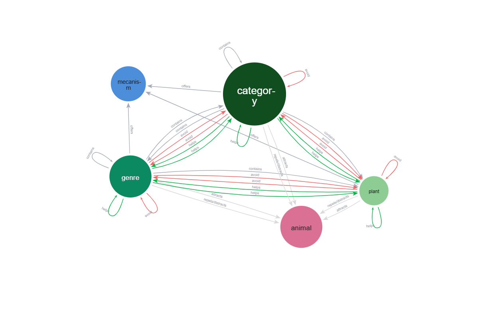
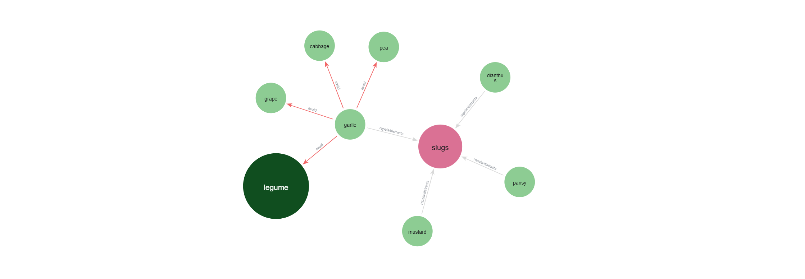

<hr>

# Projeto de Disciplina – **Relações de plantas e animais para cultivo eficiente**

Universidade Federal de São Carlos

Curso: Bacharelado em Ciência da Computação de Sorocaba

Disciplina: Processamento Massivo de Dados

Professora: Profa. Dra. Sahudy Montenegro González
<hr>

Grupo 12

**Integrantes**

- Felipe Ottoni Pereira - RA: 804317
- Letícia Almeida Paulino de Alencar Ferreira - RA: 800480

<hr>

### **Resumo:**

Este projeto propõe um sistema de apoio à decisão agrícola, combinando análise de mercado, em locais e períodos diferentes, com as relações ecológicas entre plantas, animais e seus mecanismos. Assim, ele procura identificar culturas promissoras e otimizar o cultivo por meio do plantio companheiro, promovendo sustentabilidade e produtividade. As tecnologias Neo4j, MongoDB e Spark foram integradas para gerar dados de análise de redes ecológicas e dados de produção.<br>

<hr>

## **1. DESCRIÇÃO DO TEMA** 

O plantio companheiro é uma prática agrícola baseada na combinação de diferentes espécies vegetais em um mesmo espaço, visando benefícios mútuos. Essa técnica contribui para a sustentabilidade da produção, pois reduz o uso de insumos químicos, melhora a saúde do solo e promove o controle natural de pragas. As interações entre as plantas podem ser benéficas, quando uma espécie auxilia no desenvolvimento da outra, seja repelindo pragas, atraindo polinizadores ou melhorando a disponibilidade de nutrientes, ou antagônicas, quando uma prejudica o desenvolvimento da outra, seja por competição por recursos, alelopatia ou atração de pragas indesejadas.

Além das relações diretas entre plantas, outros elementos entram nesse ecossistema agrícola, como insetos benéficos, que polinizam ou predam pragas, pragas específicas, que podem ser repelidas ou atraídas pelas plantas, nutrientes do solo, cuja disponibilidade pode ser alterada por algumas espécies, como as leguminosas, que fixam nitrogênio. Nesse sentido, entender essas relações pode fornecer insights úteis para práticas agrícolas mais produtivas, resilientes e sustentáveis, promovendo um manejo mais inteligente do solo e das espécies cultivadas. Dado que essas relações formam uma rede complexa de interações biológicas, o uso de tecnologias de dados é interessante para mapear, analisar e extrair conhecimento desse sistema.

## **2. OBJETIVO** 

O principal objetivo deste projeto é desenvolver um sistema de apoio à decisão para o setor agrícola com duas frentes complementares para gerar um cultivo eficiente:

1. **Frente de Análise de Mercado:** Realizar análises de produção agrícola por região, com base em dados históricos de culturas. Essa frente busca fornecer suporte à decisão quanto à escolha de culturas mais promissoras para investimento e onde plantar elas, com base em métricas como crescimento, demanda e produtividade.

2. **Frente Ecológica:** Modelar e analisar as relações ecológicas entre plantas, considerando aspectos como:
- Cultivos companheiros e antagônicos;
- Interações com pragas, insetos e outros animais;
- Papel de plantas no fornecimento de nutrientes, como fixação de nitrogênio e retenção de umidade no solo.

Essa frente visa auxiliar agricultores e pesquisadores no planejamento de cultivos consorciados, promovendo práticas sustentáveis, aumento da produtividade e proteção ambiental. <br>
Portanto em resumo o objetivo é gerar insights para um cultivo eficiente, eficiente de um ponto de vista de quais culturas investir, quais culturas estão em alta e com demanda no mercado agrícola e posteriormente eficiência de um ponto de vista de como otimizar a produção das culturas definidas pelos insights passados, por meio das práticas de plantio companheiro e rotação de cultura.

Já os objetivos técnicos são:
- Representar e analisar redes ecológicas complexas utilizando bancos de dados orientados a grafos (Neo4j);
- Integrar as tecnologias de dados Neo4j, MongoDB e Apache Spark;
- Demonstrar a viabilidade técnica dessa arquitetura híbrida, explorando o melhor de cada tecnologia no contexto da agricultura de precisão e sustentável.

## **3. FONTE DE DADOS**
Nesta seção, são apresentados os conjuntos de dados utilizados no desenvolvimento do projeto, com foco em explicar suas estruturas e propósitos dentro da arquitetura adotada. Cada dataset foi escolhido de acordo com a necessidade da frente para a qual foi adotado. Para melhores detalhes de como os *datasets* foram utilizados, leia a na seção 4 as implementações das tecnologias.

### **3.1 Datasets usados para a frente ecológica de plantio companheiro (Neo4j):** <br> <br>
- **companion_plant_wikipedia___after_prepro-1:**
<br><br> Essa é a principal tabela usada para o povoamento no neo4j,as outras tabelas servem como auxiliares para incrementar essa tabela ou auxiliar na limpeza e tratamento dela.<br><br>
  - *Common name*: campo com o nome usual da planta (planta podendo representar uma espécie de planta, um gênero de planta ou uma categoria de planta).
  - *Type*: campo que representa uma categoria na qual a planta está incluída.
  - *Scientific name*: campo com o nome científico da planta.
  - *Helps*: campo com uma lista das plantas que a planta representada em *"Common name"* ajuda.
  - *Helped by*: campo com as plantas que são ajudadas pela planta representada em *"Common name"*.
  - *Attracts*: Campo com uma lista dos animais que são atraídos pela planta.
  - *-Repels/+distracts*: Campo com uma lista dos animais que são repelidos pela planta.
  - *Avoid*: campo com todas as plantas que atrapalham a planta representada em *"Common name"*.
  - *Comments*: campo com uma descrição sobre detalhes e características da planta e de suas relações com outras plantas
<br>
<p align="center">
 
</p>
<br> <br>

- **tabela_extra_plantas_companheiras___Mecanismos:**
<br><br> Tabela feita analisando a descrição da coluna *"Comments"* da tabela principal para extrair os tipos de mecanismos de cada planta e adicionar a coluna *Mecanism* na tabela principal. <br><br>
  - *Plants*: nome usual das plantas.
  - *Mecansim*: lista de mecanismos que essa planta oferece.
<br>
<p align="center">

</p>
<br> <br>

- **tabela_extra_plantas_companheiras___taxonomia:** 
<br><br> Tabela que contém relações de plantas que estão dentro de determinado grupo, serve como uma tabela extra para incrementar as relações de plantas que estão dentro de determinada categoria, indo além da relação definida pela coluna Type na tabela principal. <br><br>
  - *from*: contém o nome da categoria.
  - *to*: contém o nome da planta dentro da categoria.
<br>
<p align="center">
 
</p>  
<br> <br>

- **tabela_extra_plantas_companheiras___caracteristicas_relacoes:** 
<br><br>Tabela extra construída a partir de detalhes da coluna Comments na tabela principal. A tabela estabelece relações expecíficas extras com alguns motivos do porquê algumas plantas ajudam outras.<br><br>
  - *Plant 1*: contém a planta que ajuda
  - *Plant 2*: contém a planta que é ajudada
  - Caracteristica/beneficio: contém o motivo ou benefício trazido
<br>
<p align="center">
 
</p>
<br> <br>

- **synonym:**
<br><br>Tabela para substituir palavras por sinônimos para que seja possível fazer a junção de tabelas. <br><br>
  - *name*: nome a ser substituido
  - *synonym*: sinônimo
<br> <br>
<p align="center">
 
</p>  
<br><br>

### **3.2 Datasets usados para a frente análise de Mercado agrécola (MongoDB):** <br><br>

- **df_america (Production_Crops_E_Americas.csv):**
<br><br> Esse datatset junto aos semelhantes dos outros 4 continentes, foram as principais tabelas utilizadas para o povoamento no mongoDB.<br><br>
  - *Area Code*: campo com o identificador do país do respectivo continente.
  - *Area*: campo com o nomes dos países do respectivo continente.
  - *Item Code*: campo com o identificador de uma cultura.
  - *Item*: campo com o nome de uma cultura.
  - *Element Code*: campo com o identificador dos objetos de análise agrícola.
  - *Element*: campo com o nome de um objeto de análise agrícola, podendo ser:
      - Rendimento (hg/ha): o quanto foi produzido de um produto, por unidade de área colhida.
      - Produção (tonelada): quantidade total colhida de um produto.
      - Área colhida (ha): extensão de terra de onde a produção foi efetivamente colhida. Área plantada != Área colhida
  - *Unit*: campo com as unidades de seus respectivos objetos de análise agrícola.
  - *Y[ano]*: campo com a quantidade do objeto de análise agricola da respectiva cultura.
  - *Y[ano]F*: campo com a fonte da informação sobre a cultura e seu objeto de analise
<br><br>
<p align="center">
 
</p>  

- **dataset_final:**
<br><br> Esse datatset foi gerado a partir das oprações de tratamento sobre os datasets extraídos dos continentes.<br><br>
  - *_id*: campo com o identificador do documento.
  - *continente*: campo com o nome do continente.
  - *pais*: campo com o nome do país.
  - *ano*: campo com um ano.
  - *culturas*: lista de objetos que representam as culturas do país no ano do documento
      - *nome*: campo com o nome de uma cultura.
      - *producao_(tonnes)*: campo com o valor em toneladas do quanto foi produzido. 
      - *area_colhida_(ha)*: campo com o valor em hectares do quanto se teve de área colhida.
      - *rendimento_(hg/ha)*: campo com o valor em hectagrams/hectares do quanto se teve de rendimento. 
<br>
<p align="center">
 
</p> 
<br>
<p align="center">
 
</p> 

## **4. TECNOLOGIAS E COMO FORAM IMPLEMENTADAS**

Esta seção descreve as principais tecnologias adotadas no projeto, destacando suas funcionalidades, porque foram escolhidas e a forma como foram integradas na solução proposta. As subseções a seguir detalham a função de cada tecnologia no projeto e as estratégias adotadas para integrá-las de forma eficiente e coerente com os objetivos da solução desenvolvida. Para mais detalhes, ler a seção sobre o fluxogarma [5].

<br>**Apache Spark**<br><br>
O Apache Spark será utilizado, por meio do *Databricks Notebook*, como ferramenta de ETL para extrair dados de múltiplas fontes, transformá-los (limpeza, padronização, enriquecimento) e carregá-los no MongoDB e no Neo4j. Isso porque de acordo com as documentações no Mongo e Neo, existem conectores nativos para eles com o Spark. Além do ETL, o Spark também pensamos em utilizar para análises em larga escala, como agregações complexas e estatísticas relacionadas às relações entre plantas e pragas. 

<hr>

**Neo4j**<br><br>
O armazenamento em Neo4j atuará na frente que visa explorar as relações entre as plantas para utilizar práticas como plantas companheiras e rotação de cultura para otimizar a produção de alguma planta, assim, com ele o usuario pode ter a informação sobre como plantar a cultura que desejar.

Escolhemos utilizar o Neo4j para armazenar e analisar dados sobre relações entre plantas, como no plantio companheiro e na rotação de culturas, pois permite modelar entidades (plantas, pragas, nutrientes) como nós e suas interações como arestas (ex: "atrai", "repele"). Sua abordagem orientada a grafos é ideal para navegar e consultar redes complexas, especialmente com a linguagem Cypher, permitindo uma visualização mais clara. <br>
As relações ficam como o foco, sendo propriedades navegáveis diretamente, permitindo consultas baseadas em caminhos e uma capacidade de compreender não apenas os dados, mas também as relações entre eles. Além disso, lida melhor com dados semi-estruturados e flexíveis, comuns nesse contexto, enquanto bancos relacionais exigiriam muitas tabelas e perderiam eficiência e flexibilidade.

**Esquema no Neo4j**

<div style="text-align: center;">
  
</div>

<br>

**Implementação**

Como explicado anteriormente na seção de Fontes de dados [3]. O *dataset* principal que foi tratado para gerar os *dataframes* responsáveis por realizar a inserção dos nós e dos relacionamentos foi o `companion_plant_wikipedia___after_prepro-1`. Primeiramente foi realizado as importações das bibliotecas necessárias para as transformações e para a conexão com o banco no Neo4j. Depois todos os *datasets* mencionados na seção de fontes e dados [3], foram importados no `DBFS` para serem utilizados.

Depois dentre as transformações e tratamentos necessários, houve um pequeno enriquecimento dos dados, a junção com a tabela de mecanismos para se obter uma coluna de mecanismos e a criação de uma coluna `classification` para auxiliar as inserções dos nós e arestas, indicando de qual *label* o dado se trata. Em geral, foi percebido que para as escritas dos nós era essencial uma coluna com elementos distintos que se quer inserir, já para os relacionamentos era necessário estruturar o *dataframe* com no mínimo duas colunas, uma representando o nó de origem e a outra representando o nó de destino da aresta. Além disso a coluna *classification* foi usada para fazer as filtragens necessárias para assim fixar os *labels* para as escrita no banco.

Outras transformações realizadas foram o uso de funções e da biblioteca `inflect` para singularizar e pluralizar palavras para que assim, fosse possível realizar junções para descobrir seu *label* (a partir da coluna `classification`).

Falando um pouco mais do fluxo do processamento, a coluna `Common Name` foi usada para uma escrita inicial dos nós de `plant`, `genre` e `category`. Depois a coluna `Type` foi utilizada para incrementar as escritas de nós `category` e também a criação de relacionamento `contains` saindo de `category` para outros tipos de nó. A coluna `Scientific name` foi usada, para - utilizando a primeira palavra do nome cientifico - incrementar os nós de `genre` e estabelecer relações de `contains` entre `genre` e `plant`.

Depois foi realizada a criação das função de pluralizar e singularizar palavras, para tratar as palavras dentro das colunas (`Helps`, `Helped by`, `Attracts`, `-Repel/+distracts` e `Avoid`).
Após a criação dos vetores, da "explosão" deles e da singularização de seus elementos, as colunas `Helps` e `Helped by` tiveram cada uma um *join* com a tabela "principal" para se obter os *labels* dos elementos delas, e depois os dados de ambas foram unidos, levando em consideração a interpretação contrária que as colunas `Helps` e `Helped by` estabelecem com o elemento ao qual elas se referem - quem ajuda e quem é ajudado.

A coluna `Avoid`´ também teve um vetor criado, explodido e seus elementos singularizados, posteriormente sofrendo *joins* para obtenção dos *labels* de seus elementos, e então foi feito a escrita dos relacionamentos `Avoid` no banco. O mesmo processo foi realizado para as colunas `Attracts` e `-Repel/+distracts`, com a exceção de que para elas foi realizado a pluralização de seus elementos e que antes da criação desses relacionamentos foi necessário unir os elementos delas e usar o *distinct* para criação dos nós `animal`. Além disso, também foi realizada a escrita de relacionamentos extras `´Helps`, por meio de outra tabela extra `tabela_extra_plantas_companheiras___caracteristicas_relacoes` - com propriedades específicas entre os dois sujeitos. 

Também houve a criação dos nós de `mecanism` e do relacionamento `offers`, de forma semelhante a criação dos nós e dos relacionamentos envolvendo `animal`, conforme explicado acima.
Observe que a coluna `classification`´ teve papel fundamental em praticamente todas as escritas no banco, indicando os *labels* para que fosse assim realizado a filtragem possibilitando a escrita dos nós e dos relacionamentos parte por parte.

Para conectar o *notebook pyspark* com o banco mongoDB a biblioteca `org.neo4j:neo4j-connector-apache-spark_2.12:5.3.6_for_spark_3` foi instalada no cluster, dessa maneira, a conexão funcionou definindo as configurações de acesso ao banco no Neo4j e as configurando na construção do *SparkSession*. 

- Exemplo de código para a escrita de nós
```python
df_nodes_plant = df_plantas.filter(col("classification") == "plant")\ #filtragem do label
                .select(col("Common name").alias("name"), lower(col("Scientific name")).alias("scientific_name")) 

(
    df_nodes_plant.write
    .format("org.neo4j.spark.DataSource")
    .mode("append")
    .option("labels", ":plant") #define o tipo do nó
    .option("node.keys", "name")  # define chave do nó
    .save()
)
```

- Exemplo de *dataframe* antes da filtragem dos *labels* para inserção das relações:
<p align="center">

</p>

- Exemplo código para a escrita de relações `plant --> ajuda --> genre`
```python
# plant --> ajuda --> genre
df_help_filtrado = df_help_total.filter(
    (col("source_label") == "plant") & (col("target_label") == "genre")
)

(
    df_help_filtrado.write
    .format("org.neo4j.spark.DataSource")
    .mode("append")
    .option("relationship", "helps")
    .option("relationship.save.strategy", "keys")
    .option("relationship.source.labels", ":plant")
    .option("relationship.source.node.keys", "source_name:name")
    .option("relationship.target.labels", ":genre")
    .option("relationship.target.node.keys", "target_name:name")
    .save()
)
```

A implementação pode ser melhor analisada por meio do *notebook* `PMD_Projeto_Grupo12_Neo4j.ipynb` presente neste repositório.

<hr>

**MongoDB**<br><br>
O armazenamento no MongoDB atuará na frente que tem como objetivo indicar ao usuário onde e o que plantar, com informações sobre culturas plantadas em determinadas regiões e períodos. Escolhemos essa tecnologia por sua flexibilidade em lidar com dados heterogêneos e esquemas dinâmicos, o que é ideal para representar a produção agrícola em diferentes países, culturas e anos. Cada documento pode conter métricas variadas de produção, mesmo com campos ausentes ou inconsistentes. Isso facilita a análise de mercado e produção por região, permitindo consultas agregadas e comparações sem a complexidade de joins típicos em bancos relacionais. Além disso, o modelo pode evoluir com o tempo, incluindo novas variáveis conforme necessário, o que favorece análises históricas e comparativas.

**Esquema no MongoDB**

```javascript
_id: "38"
continente: "africa"
pais: "cabo verde"
ano: 1982
▾ culturas: Array (36)
  ▾ 0: Object
    nome: "oilcrops"
    producao_(tonnes): 10082 area_colhida_(ha): 3124
    rendimento_(hg/ha): 32273
  ▾ 1: Object
    nome: "onions, dry" producao_(tonnes) : 300
    area_colhida_(ha): 20
    rendimento_(hg/ha): 150000
```

**Implementação**

A implementação da frente de análise de mercado iniciou ao encontrarmos os dados relacionados a produção agrícola no mundo [7] e ao analisarmos que suas informações poderiam ser utilizadas em nosso projeto. Nesse sentido, iniciou-se o processo de ETL com a extração dos dados dos *datasets* encontrados para o *notebook databricks*, que depois foram carregados para *dataframes*, por meio do `spark.read`, para que a etapa de transformação fosse realizada. Foram criados um dataframe para cada continente, do mesmo modo com estavam os *datasets* encontrados.

Primeiro, foi realizada a normalização dos dados transformando todos os textos para minúsculo, depois a remoção das colunas que traziam as fontes dos dados de cada indicador, por ano, uma vez que esse dado não será utilizado em nossas análises. A coluna `Item` foi renomeada para `Cultura` para melhor compreensão e leitura dos dados. Adicionamos a coluna `continente` para que ao juntar os dataframes essa informação fosse mantida. Essas operações foram realizadas por meio de funções python com o `pyspark.sql.functions` pois assim foi mais flexível trabalhar com os cinco dataframes criados.

Com as transformações e limpezas iniciais concluídas, iniciamos a reestruturação dos dataframes de modo ao final, obter a estrutura a ser inserida no mongoDB. Para isso foram necessárias duas operações de pivot table. A primeira foi transformar as colunas `Yaaaa` em valores da coluna `ano`, criada nessa etapa. Assim, essa operação resultou em duas colunas novas, `ano` com os números dos anos e `valor` com os números que representam as quantidades dos indicadores agrícolas da coluna `Element`, que antes estavam nas colunas `Yaaa`. Isso aumentou o número de linhas dos dataframes e diminuiu o número de colunas. Depois, houve a transformação do tipo de dados da coluna `valor` de string para float. Já a segunda operação de pivot foi para transformar os dados da coluna `Element` em colunas para cada indicador com sua respectiva unidade de medida. Com isso, as coluna `Unit` e `valor` foram removidas e as colunas area_colhida_(ha), rendimento_(hg/ha) e producao_(tonnes) foram criadas e seus dados são os valores dos índices, que antes estavam na coluna `valor`. Após essas duas operações os cinco dataframes foram unidos, etapa tranquila uma vez que possuem as mesmas colunas.

Por fim, a última etapa do processo de transformação foi o agrupamento por continente, pais (`Area`) e ano para chegar na estrutura final a ser inserida no banco de dados. Com o agrupamento, uma lista de objetos `culturas` foi gerada com os campos nome, `area_colhida_(ha)`, `rendimento_(hg/ha)` e `producao_(tonnes)`. Ela se tornou uma coluna no *dataframe*, removendo as colunas `cultura`,  `area_colhida_(ha)`, `rendimento_(hg/ha)` e `producao_(tonnes)`. Além disso, foi criada a coluna `_id` preenchida sequencialmente para ser o identificador dos documentos. Então, o esquema abaixo foi atingido:

```python
|-- _id: string (nullable = false)
|-- continente: string (nullable = false)
|-- pais: string (nullable = true)
|-- ano: integer (nullable = false)
|-- culturas: array (nullable = false)
|    |-- element: struct (containsNull = false)
|    |    |-- nome: string (nullable = true)
|    |    |-- producao_(tonnes): double (nullable = true)
|    |    |-- area_colhida_(ha): double (nullable = true)
|    |    |-- rendimento_(hg/ha): double (nullable = true)
```

Para conectar o *notebook pyspark* com o banco mongoDB a biblioteca `org.mongodb.spark:mongo-spark-connector_2.12:10.5.0` foi instalada no cluster, dessa maneira, a conexão funcionou utilizando a mongo URI do banco e o método `.format("mongodb")` nas operações de *read* e *write* com os *dataframes*. Portanto, para carregar o *dataframe* final gerado, foi realizada a operação `.write.format("mongodb")` com as informações sobre em qual banco e qual coleção ele deveria ser inserido e para verificar a inserção utilizamos a operação de `.read.format("mongodb")`.

A implementação pode ser melhor analisada por meio do notebook `PMD_Projeto_Grupo12_MongoDB.ipynb` presente neste repositório.

<hr>

<br>

## **5. FLUXOGRAMA DO SISTEMA**<br>

O fluxo do projeto consistiu em um processo de ETL, utilizando datasets diferentes para ambas as frentes, extraindo-os para um *notebook* individual para cada frente no *databricks*, onde foram realizados os processos de transformação, limpeza e *load*, sendo processados por meio do *PySpark*.   Um notebook realizava o *load* para o um banco de dados MongoDB, enquanto o outro carregava os dados para um banco de dados no Neo4j. Depois dos bancos devidamente povoados, consultas foram realizadas utilizando No MongoDB a interface gráfica Compass e a linguagem MQL, enquanto para o Neo4j foi utilizado o Neo4j Aura com consultas feitas por meio da linguagem Cypher. 
<br>


<br>

## **6. CONSULTAS E RESULTADOS**<br>

**MongoDB**

```shell
db.producao_agricula_final.countDocuments()
> 12390
```

- Quais culturas tiveram pouco (rendimento menor que 10.000 hg/ha) rendimento na Austrália nos últimos 3 anos?

```shell
db.producao_agricola_final.aggregate([
  { $match: { pais: "australia", ano: { $gte: 2016 } } },
  { $unwind: "$culturas" },
  { $match: { "culturas.rendimento_(hg/ha)": { $lt: 10000 } } },
  {
    $project: {
      ano: 1,
      cultura: "$culturas.nome",
      rendimento: "$culturas.rendimento_(hg/ha)"
    }
  }
])
  
> {
    _id: '17179870612',
    ano: 2016,
    cultura: 'safflower seed',
    rendimento: 5928
  }
  {
    _id: '17179870612',
    ano: 2016,
    cultura: 'canary seed',
    rendimento: 6793
  }
```
  
- Listar o top 5 culturas com maior produção (toneladas) na Europa (últimos 5 anos)

```shell
db.producao_agricola_final.aggregate([
  { $match: { continente: "europa", ano: { $gte: 2015, $lte: 2019 } } },
  { $unwind: "$culturas" },
  { $match: { "culturas.producao_(tonnes)": { $ne: null } } },
  {
    $project: {
      cultura: "$culturas.nome",
      producao: "$culturas.producao_(tonnes)",
      pais: 1,
      ano: 1
    }
  },
  { $sort: { producao: -1 } },
  { $limit: 5 }
])

>{
  _id: '42949674287',
  pais: 'russian federation',
  ano: 2017,
  cultura: 'cereals, total',
  producao: 131289930
}
{
  _id: '51539608850',
  pais: 'russian federation',
  ano: 2019,
  cultura: 'cereals, total',
  producao: 117868242
}
{
  _id: '25769805096',
  pais: 'russian federation',
  ano: 2016,
  cultura: 'cereals, total',
  producao: 117751078
}
```
  
- Qual a cultura com maior quantidade de área colhida (hectare)? Onde foi colhida? (últimos 10 anos)

```shell
db.producao_agricola_final.aggregate([
  { $match: { ano: { $gte: 2009, $lte: 2019 } } },
  { $unwind: "$culturas" },
  { $match: { "culturas.area_colhida_(ha)": { $ne: null } } },
  {
    $project: {
      cultura: "$culturas.nome",
      area: "$culturas.area_colhida_(ha)",
      pais: 1,
      continente: 1,
      ano: 1
    }
  },
  { $sort: { area: -1 } },
  { $limit: 1 }
])

> {
  _id: '779',
  continente: 'asia',
  pais: 'china, mainland',
  ano: 2015,
  cultura: 'cereals, total',
  area: 103281871
}
```

- Qual cultura teve uma grande produção no Brasil em 2018?

```shell
db.producao_agricola_final.aggregate([
  { $match: { pais: "brazil", ano: 2018 } },
  { $unwind: "$culturas" },
  { $match: {"culturas.producao_(tonnes)": { $ne: null } } },
  {
    $project: {
      cultura: "$culturas.nome",
      producao: "$culturas.producao_(tonnes)"
    }
  },
  { $sort: { producao: -1 } },
  { $limit: 1 }
])

> {
  _id: '34359738851',
  cultura: 'sugar cane',
  producao: 747060316
}
```

<br>

**Neo4j**
- Das plantas que repelem lesmas quais outras plantas atrapalham e oferecem risco para o seu cultivo?
```shell
MATCH (p2:plant) -[r:`repels/distracts`]-> (a:animal)
WHERE a.name = 'slugs'
OPTIONAL MATCH (p2) -[h:avoid]-> (p1)
OPTIONAL MATCH (p1)-[c:contains]->(p3:plant)
RETURN p1, p2, r, a, h, p3, c
```
<div style="text-align: center;">
  
</div>
  
- Qual o menor caminho para gerar uma disposição física benéfica entre duas plantas específicas? (o que plantar ao lado do que)
```shell
MATCH p = shortestPath((p1:plant {name: "pumpkin"}) -[:helps*1..5]-> (p2:plant {name: "strawberry"}))
WHERE ALL(node IN nodes(p) WHERE node:plant)
```
<div style="text-align: center;">
  
</div>
  
- Quais são as plantas que ajudam a batata por meio da fixação de nitrogênio?
```shell
MATCH (p1:plant) -[o:offers]-> (m:mecanism {name: 'nitrogen fixation'})
MATCH(p1)-[h:helps]->(p2 {name: "potato"})
RETURN p1, p2, h
```
<div style="text-align: center;">
  
</div>
  
- Quais são as plantas que mais ajudam plantas que são ervas?
```shell
MATCH (p1:plant) -[:helps]-> (p2:plant)
MATCH (p2) <-[:contains]- (c:category {name: 'herb'})
RETURN p1.name AS plant, count(p1) AS help_count
ORDER BY help_count DESC
LIMIT 5
```
<p align="center">

</p>

<hr>

## **7. DIFICULDADES**

Dentre as dificuldades e limitações enfrentadas na frente do plantio companheiro destaca-se o esforço para montagem de tabelas extras como a de mecanismos, pois ela foi feita de forma manual por meio da descrição da coluna de comentários, que muitas vezes eram desconexos e muito diverso. Para conseguirmos atingir o planejamento do esquema que estipulamos foi necessária uma análise de comentário linha a linha, identificando as possíveis categorias de mecanismos e movendo detalhes para as posições mais adequadas. <br><br>

Na parte de transformações e carga, durante a inserção de relações *contains* entre gêneros e plantas - *(g:genre) -[contains]-> (p:plant)* - houve um erro que não conseguimos identificar a causa, o esquema do banco no Neo4j Aura mostra relações de gênero contendo um gênero e de gênero contendo uma categoria, entretando ao realizar consultas *Cypher* procurando essas relações elas não existem, mesmo após investigação nos *dataframes* e nos *labels* usados, não encontramos nenhum indício de uma tentativa de inserção com esses *labels*. <br><br>

Além disso outra limitação percebida nessa frente foi que por conta dos formatos dos dados foi necessário singularizar e pluralizar algumas palavras para ser possível realizar as junções necessárias, foi-se usado funções UDF e a biblioteca *inflect* para tal feito, entretando foi necessário se atentar as exceções para palavras que a biblioteca *inflect* não conseguia identificar. Para identificar as exceções foram feitas junções e com isso foi criado a lista de exceções, entretanto se os dados fossem muito maiores essa dificuldade poderia se tornar uma limitação. <br><br>

Já na frente de análise de mercado, as dificuldades enfrentadas foram na etapa de reestruturar o dataset a fim de construir linhas que representassem um documento no mongo para possibilitar o carregamento dos dados no banco. Além disso, houve a tentativa de limpar dos documentos culturas que haviam valores nulos para os três campos (produção, rendimento e área colhida), mas no desenvolvimento da lógica da função que faria isso ao escrever no novo dataset do resultado, a lista de culturas era multiplicada pelo número de culturas, por exemplo, se a linha havia uma lista de 30 culturas, após esse tratamento ela ficava com um lista com 30 listas cada uma com 30 culturas. Desse modo, na etapa de carga ocorria o erro de ultrapassar o espaço de armazenamento grátis disponivel no mongoDB (512Mb). Assim, esse tratamento foi removido, então no banco há culturas com valores nulos, mas isso foi considerado na construção das consultas. <br><br>

No geral outra limitação percebida foi na integração entre os resultado das duas frentes, houve dificuldade em conseguir juntar os *insights*, ou seja utilizar os resultados de consultas da frente de análise de mercado agrícola como entrada para consultas da frente de plantio companheiro, pois o dataset de plantio companheiro possui bem menos entradas em relação ao de análise de mercado agrícola, fazendo com que muitas plantas levantadas como resultado pela primeira frente não tivesse dados na segunda frente, porém para o processo inverso não haveria tantos problemas, pois a maioria das plantas presentes na frente de plantio coletivo possui entradas na outra frente, então ainda sim seria possível por exemplo analisar as plantas companheiras que vc gostaria de utilizar pela frente dois depois de decidido, levar essas plantas para uma análise do ponto de vista comercial e de mercado, proporcionado pela outra frente.Desse modo, enxergamos como possíveis melhorias a possibilidade de juntar os dois notebooks gerados nos processos de ETL, enriquecer os dados e a criar um pipeline para a realização das consultas, a fim de integrar os resultados das duas frentes.<br>

## **8. CONCLUSÕES**

A principal conclusão deste projeto é que a forma como os dados são modelados e armazenados tem impacto direto na eficiência das consultas e na qualidade dos resultados obtidos. Assim, percebemos que a escolha da tecnologia de banco de dados deve estar alinhada com os objetivos da aplicação e com a estrutura dos dados utilizados. O uso de bancos NoSQL, como os orientados a documentos e a grafos, demonstrou ser interessante no contexto onde tínhamos dados semiestruturados e fortemente relacionados, o que permitiu maior flexibilidade, redução de campos nulos e menor necessidade de operações custosas como joins, que implicam mais quantidades de acesso a discos e dados fisicamente distantes, principalmente se tratando de dados massivos.<br>

Outro ponto essencial foi o raciocínio de modelagem por agregados, especialmente nos bancos orientados a documentos, pois ao estruturar os dados de forma que as informações frequentemente consultadas juntas estejam agrupadas em um único documento, torna-se possível recuperar todos os dados necessários com um único acesso ao disco. Essa abordagem melhora o desempenho do sistema e reduz a complexidade das consultas. No caso dos bancos orientados a grafos, a modelagem das relações também se mostrou eficiente para representar dados fortemente conectados, otimizando consultas baseadas em relacionamentos complexos.<br>

Além disso, a etapa de processamento e transformação dos dados no Databricks notebook com PySpark teve papel fundamental no projeto, permitindo tratar grandes volumes de dados. Com o uso do Spark, foi possível aplicar normalizações, agregações e reestruturações nos dados, preparando-os adequadamente para os diferentes modelos de armazenamento escolhidos, além da existência de conectores entre os bancos e o spark, facilitando a integração entre as tecnologias. Essa fase foi essencial para garantir a qualidade dos dados antes de sua carga final nos bancos, evidenciando a importância do pré-processamento para o sucesso das etapas subsequentes de análise e consulta.<br>

## **9. FONTES**

1. Companion Planting | Portland Nursery. Disponível em: <https://www.portlandnursery.com/veggies/companion-planting>.
2. Rotação de culturas: objetivos, vantagens e desvantagens. Disponível em: <https://brasilescola.uol.com.br/geografia/rotacao-culturas.htm>.
3. WIKIPEDIA CONTRIBUTORS. List of companion plants.  <‌https://en.wikipedia.org/wiki/List_of_companion_plants#>
4. HTTPS://WWW.FACEBOOK.COM/MARTHASTEWART. Companion Planting Is the Key to a Thriving Vegetable Garden—Here’s How to Pair Varieties to Deter Pests and Attract Pollinators. Disponível em: <https://www.marthastewart.com/8379510/companion-planting-guide>.
5. 14 Vegetables You Should Never Plant Together. Disponível em: <https://www.marthastewart.com/vegetables-to-never-plant-together-8425391>.
6. GOVERNMENT, N. T. Companion planting. Disponível em: <https://nt.gov.au/environment/home-gardens/companion-planting>.
7. MOMENI, M. Crop Production. Disponível em: <https://www.kaggle.com/datasets/imtkaggleteam/crop-production>. Acesso em: 18 jun. 2025.
8. HUANG, S. Maintain a Companion Plant Knowledge Graph in Google Sheets and Neo4j | Towards Data Science. Disponível em: <https://towardsdatascience.com/maintain-a-companion-plant-knowledge-graph-in-google-sheets-and-neo4j-4142c0a5065b/>. Acesso em: 18 jun. 2025.
9. COMPANION_PLANT_WIKIPEDIA. companion_plant_wikipedia. Disponível em: <https://docs.google.com/spreadsheets/d/1U4K93EeOU6V4SZ9AgI3wOeV4kgdW9TmKSY_pIypDA-A/edit#gid=0>. Acesso em: 18 jun. 2025.
10. PATEL, Y. Vegetables Cultivation Data Exclusive. Disponível em: <https://www.kaggle.com/datasets/ysthehurricane/vegetables-cultivation-data-exclusive?select=vegetablecropNPK.csv>. Acesso em: 18 jun. 2025.

---

Sorocaba, 2025
